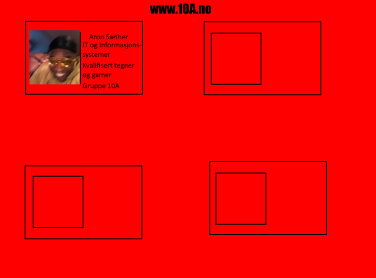
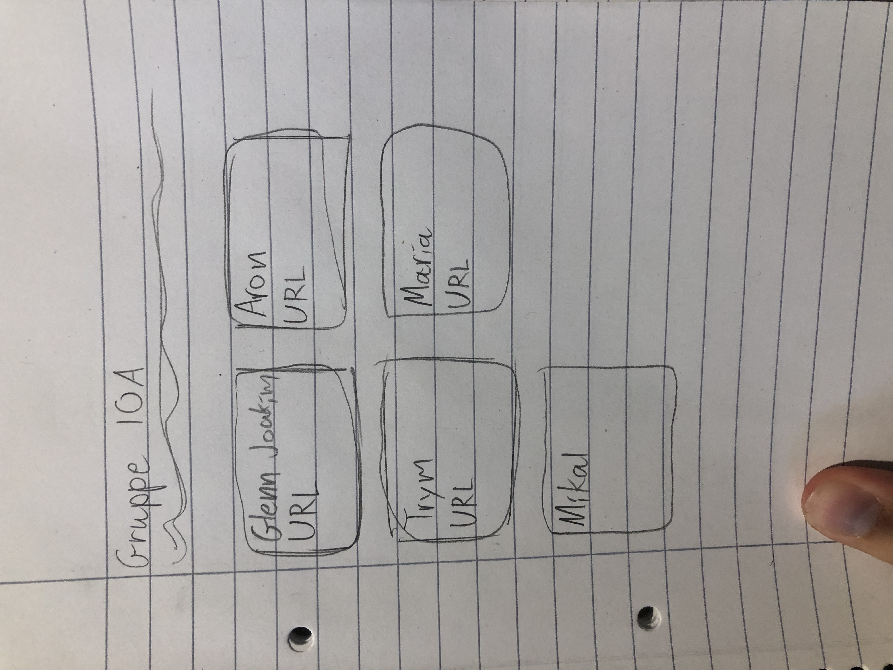
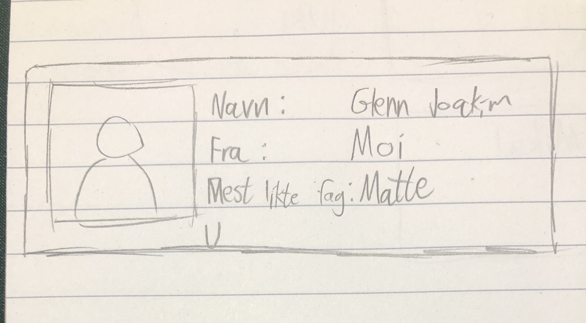
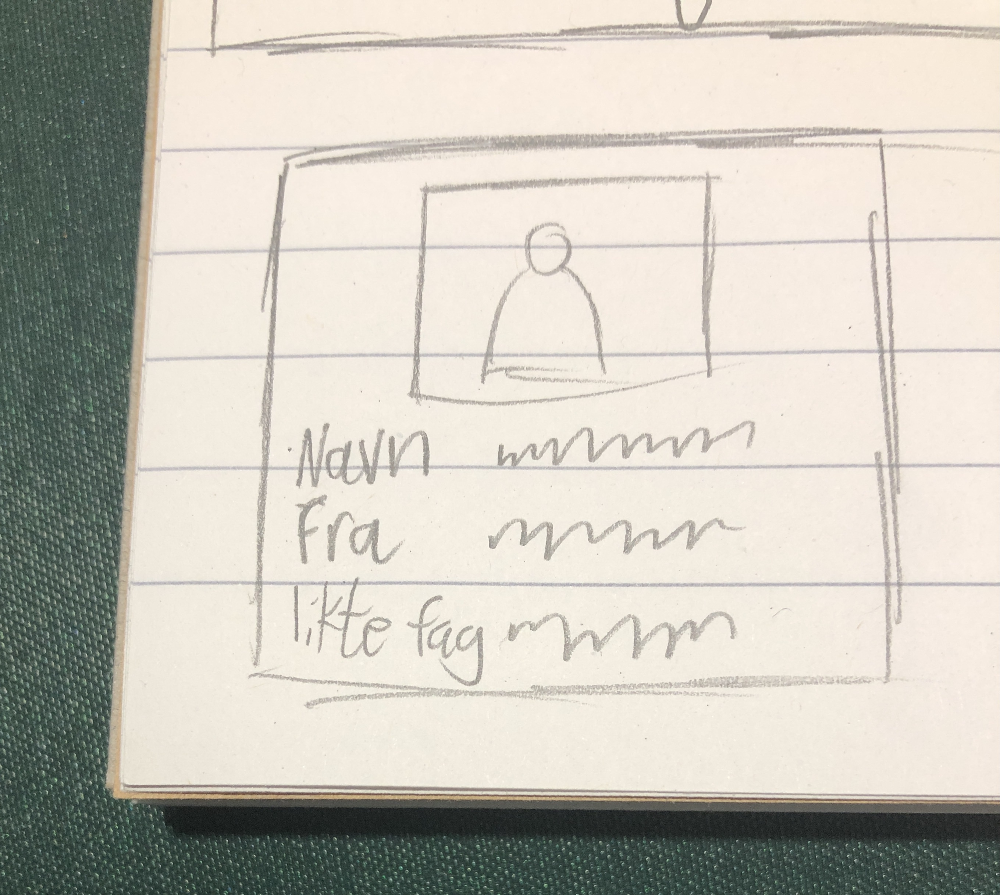
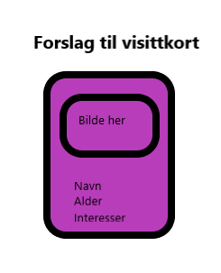
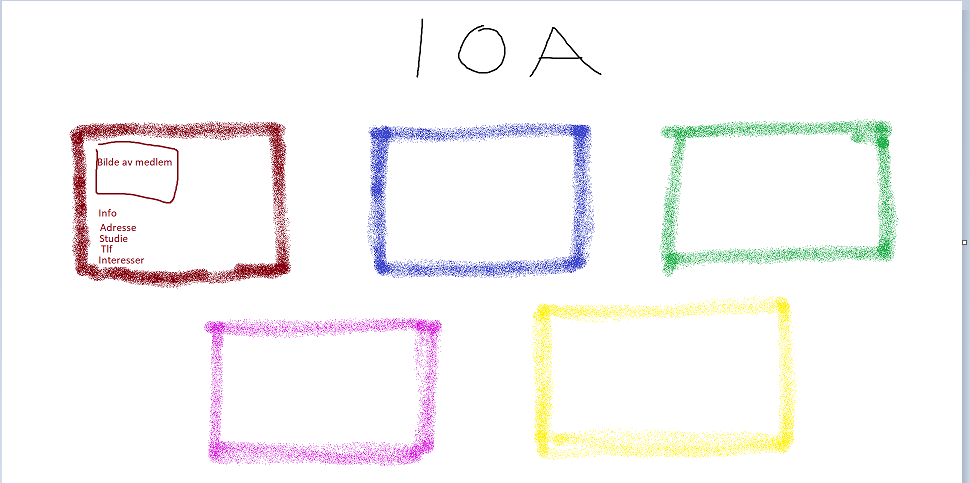
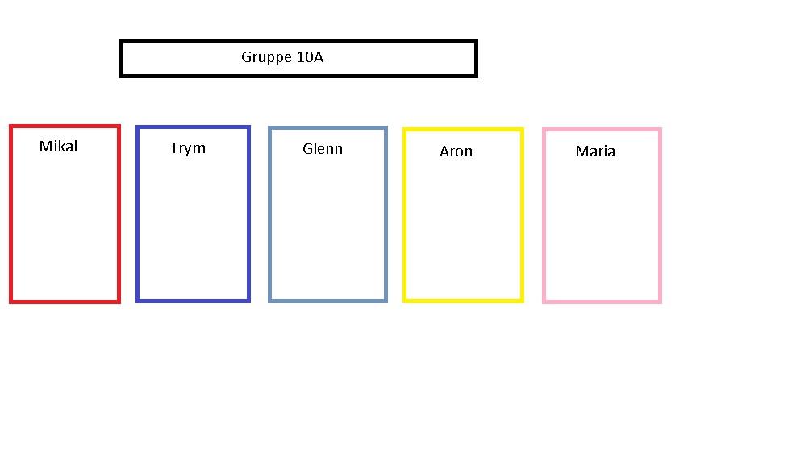
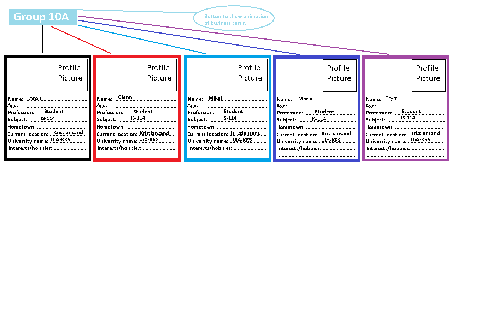
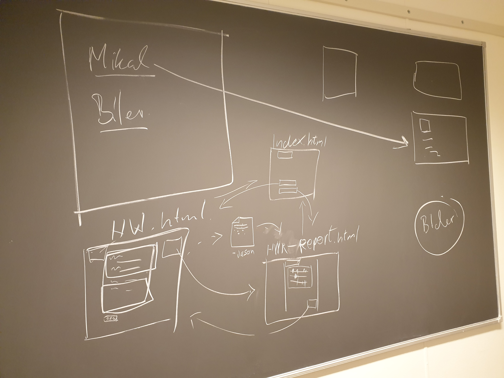
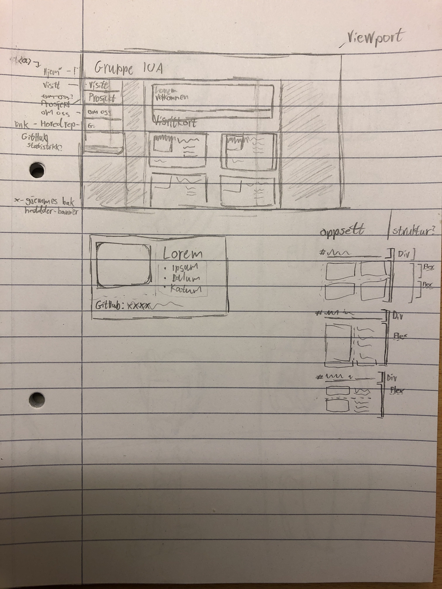

## Welcome to Group 10A's Repository

Group Participants | Github links
---|---
**Glenn J. Bakklund** | *[https://github.com/GlennJoakimB](https://github.com/GlennJoakimB)*
**Trym Falkum** | *[https://github.com/trfa2](https://github.com/trfa2)*
**Mikal Sand** | *[https://github.com/AfGhost](https://github.com/AfGhost)*
**Aron Sæther** | *[https://github.com/AronSaether](https://github.com/AronSaether)*
**Maria Osiak** | *[https://github.com/Maria-Osiak](https://github.com/Maria-Osiak)*

### Link to our Github page
[https://maria-osiak.github.io/10A/](https://maria-osiak.github.io/10A/)

If we have trouble with pages, check out [documentation](https://docs.github.com/categories/github-pages-basics/) or
[contact support](https://support.github.com/contact) and it might help.

Repository info:
Hovedrepositoryen er delt opp i en branch til hver, og kun det nødvendige blir dratt inn på main branchen.
Alle som endrer ting og jobber med sine filer, bruker sin branch først før evt merging om det godkjennes. På denne måten
slipper vi å krølle til selvet main filer.

Visittkort:
- Alle tegnet sine ideer i forhold til visittkort layout/designet.
- Noen tegnet digitalt og noen på papir og noen begge deler.
- Alle valgte sine farger.
- Alle kom med sine forslag til hva som kan stå på kortene.
- Etter forslag ble dette lagt til i repository der vi kunne sjekke og samtidig kommentere.
- Vi valgte kun få simple punkter (det viktigste) for profil informasjon.
  - Dette som profilbilde
  - Navn
  - Fra
  - Interesser
  - Hva vi liker
- Vi unngikk å skrive noe privat informasjon som, mobil nr eller epost adresse.

- Aron: 

- Glenn: 

- Maria:

- Trym:

- Mikal:

How We Roll:
- Først begynte vi å tegne og lage en skisse på tavle under gruppearbeid, der vi tegnet en brukerreise med linker til de 
forskjellige sidene for å forstå oppsettet og hjelpe oss med visualisering.
- Gruppa: 

- Glenn:

- Gruppelederen la ut noen spørsmål relatert til HWR på discord
LHWR02 trenger vi spørsmål til.
Kan alle prøve å tenke ut 2 spørsmål hver som e relatert til prosjektarbeid?
Tre eksempler på spørsmål som listes opp i oppgaveteksten til «How we roll» er:
• om man er morgen fugl eller natteravn
• om man jobber beste alene eller med andre
• om man gir lang forklaring eller gå rett på sak
(Disse eksemplene passer best til for eksempel slidere som går fra 0 til 100)

- Vi har også sett litt på Janis sine eksempler som ligger inne på how-we-roll.html for å forstå oppgavene.
- Vi oprettet da en enkel index.html fil med det viktigste for å lære.
- Deretter la vi til lenker til de forskjellige sidene som hwr.html og report.html.
- Til slutt fokuserte vi på selvet designet, fargene, bakgrunn osv.
- Under denne tiden fant vi ut at vi skal bytte på kort layouten og lagde en helt annen enn det vi tegnet i begynnelsen.
Dermed ble en liten avvik når det gjaldt selvet kortene, men vi beholdt side oppsettet samt bakgrunnsfarger og slikt. 
Noen få ting måtte endre grunnet visittkort endringene.
- Tilslutt ble det lagd en script for spørreskjema, noe som vi er fortsatt ganske usikre på.

Litt om utfordringer:
Vi organiserte oss ikke på noen spesiell måte, og fortsatte å jobbe i den guppen vi er siden vi er en liten gruppe. 
Det var ujevne forhold på hvor mye vi forsto av det som ble undervist og uten tvil fikk Glenn Joakim (gruppeleder) lært 
seg mest av det som vi skulle, men han har vært flink og tålmodig til å lære bort sin kunnskap så godt han klarer.
Selvom vi startet med null organisering, så begynner vi å komme oss. Vi begynner å bli flinkere til å gi hverandre
oppgaver og hjelpe hverandre med å følge med og informere om ting.
Utfordringene har vært å forstå de forskjellige oppgavene, men så fort det er klart så klarer vi å jobbe med stoffet
og utføre oppgavene.
Utfordringene er fortsatt at alle er ikke på lik linje når det gjelder å forstå GitBash/GitHub og andre verktøy som 
IntelliJ/Visual Studio vi bruker.

Verktøy brukt:
I begynnelsen brukte vi ikke mange verktøy utenom Github og GitHub/GitBash, men Glenn hadde vært borti IntelliJ 
og foreslo det til oss for fun.html filen.
Etterhvert begynte noen av oss både IntelliJ og også Visual Studio for å lære litt mer om forskjellene og bruken.
Noen av oss har også lastet ned GitDesktop som gjør det lettere med pull/push osv direkte til main repo. Men valgte å 
ikke bruke den så mye, for å lære og bli mer vant til kommandoer direkte i GutBash.
